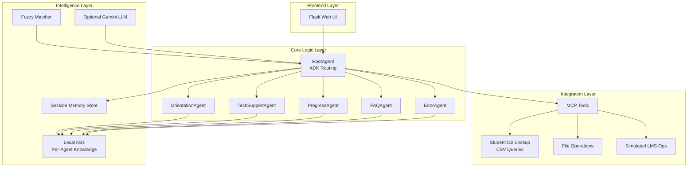
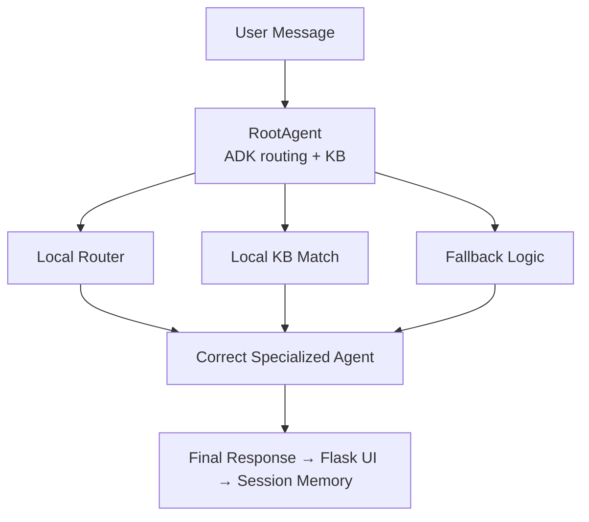

# 📘 Student Support Concierge — Multi-Agent AI Platform

> **Google Agents Intensive Capstone Project** > **Track:** ✔️ Concierge Agents

A fully automated multi-agent AI support system designed for educational institutions. This platform employs a team of specialized intelligent agents to handle student onboarding, technical troubleshooting, progress tracking, and FAQ responses.

Powered by ADK routing, optional Gemini LLM integration, local knowledge bases, MCP tools, and a modern Flask web interface, this project demonstrates how agents can automate real-world workflows with accuracy, reliability, and scalability.

---
<div align="center">


</div>

## 🟦 1. The Problem & Solution

### ❗ The Problem
Student support teams are overwhelmed by repetitive queries ("How do I log in?", "What is my progress?"). Traditional chatbots fail because they:
* Hallucinate answers.
* Lack domain expertise.
* Cannot perform actions (like checking database records).
* Fail completely if the LLM goes offline.

### 💡 The Solution: A Multi-Agent Ecosystem
Instead of one generalist bot, we deploy 5 Specialized Agents coordinated by a Root Agent.

| Agent | Role |
| :--- | :--- |
| **🎓 OrientationAgent** | Handles onboarding and course initialization. |
| **🛠️ TechSupportAgent** | Resolves access codes, login issues, and LMS errors. |
| **📈 ProgressAgent** | Fetches real-time student progress and completion status. |
| **❓ FAQAgent** | Answers static policy questions (duration, timings, etc.). |
| **⚠️ ErrorAgent** | Manages crash reports and debugging. |
| **🧠 RootAgent** | The intelligent router that directs traffic to the correct expert. |

## 🟦 1. Why Agents ?

Traditional single-chatbot systems struggle with:
* Mixing up responsibilities
* Producing generic or incorrect responses
* Lacking reliability without LLM
* Failing to scale across domains
* Poor maintainability

### ✔ Agents specialize
Each agent becomes an expert in:
* Onboarding
* Tech support
* Progress tracking
* Policies
* Error handling

### ✔ Agents collaborate
A RootAgent routes queries to the correct specialist — like a real support team.

### ✔ Agents ensure accuracy
Using:
* Local per-agent KBs
* Fuzzy-matching
* Domain rules
* Memory
* (Optional) Gemini LLM

### ✔ Agents scale
New agents can be added seamlessly.

### ✔ Agents align with Capstone requirements
This project demonstrates:
* Multi-agent workflow
* MCP tools
* Sessions & memory
* Observability
* LLM-enhanced behaviors
* ADK architecture

This is why an agent-based system is the most realistic, scalable, and meaningful approach.

---

### System Layer Architecture


---
## 🟦 2. Track Selection

**Track:** ✔ Concierge Agents

This project automates a real daily-life workflow for students:
➡️ Getting reliable support instantly while studying.

---

## 🟦 3. Problem & Solution Pitch

### ❗ Problem
Student support teams repeatedly answer the same questions:
* “How do I start my course?”
* “I need an access code.”
* “I can’t log in.”
* “What’s my progress?”
* “Do I get a certificate?”

**This causes:**
* Overloaded staff
* Delayed responses
* Lower student satisfaction

**Regular chatbots:**
* Hallucinate
* Lack expertise
* Fail offline
* Mix unrelated topics

### 💡 Solution — Student Support Concierge
A multi-agent AI system with 5 specialized agents:
| Agent | Role |
| :--- | :--- |
| **🎓 OrientationAgent** | Onboarding, course start guidance |
| **🛠 TechSupportAgent** | Access codes, login help, LMS troubleshooting |
| **📈 ProgressAgent** | Progress lookup & completion guidance |
| **❓ FAQAgent** | Policies, timings, schedules |
| **⚠ ErrorAgent** | System errors, debugging |
| **🧠 RootAgent** | Intelligent message routing |

### The system uses:
* Local KB fallback
* Fuzzy matching
* MCP tools
* Session memory
* Optional Gemini
* A polished Flask UI

### Value Delivered:
* ✔ 24/7 instant support
* ✔ Reduces human workload
* ✔ Higher accuracy than chatbots
* ✔ Works even without LLM

---

## 🟦 4. Key Features Demonstrated (Capstone Requirement)
This project includes 11+ features — far exceeding the required minimum.

### ✔ Feature Table

| Category | Feature | Status |
| :--- | :--- | :--- |
| **Multi-Agent System** | RootAgent + 5 Sub-agents | ✔ |
| | Sequential routing pipeline | ✔ |
| | Agent collaboration | ✔ |
| **Tools** | MCP-compatible tools | ✔ |
| | Custom DB lookups | ✔ |
| **Knowledge Base** | Local KB per agent | ✔ |
| | Fuzzy matching | ✔ |
| **LLM Use** | Gemini optional integration | ✔ |
| **Sessions** | Full memory system | ✔ |
| **Observability** | Logging + agent-status endpoint | ✔ |
| **Long-running ops** | longrunning.py | ✔ |
| **Deployment** | Flask server, Cloud-ready | ✔ |
---


## 🟦 5. Technical Architecture

### High-Level Flow



### Why this architecture works
* **RootAgent** ensures structured routing
* **Local KB** ensures correctness
* **Fuzzy matching** improves reliability
* **Sessions** ensure conversation continuity
* **MCP tools** integrate with files & databases
* **Flask UI** enables real-world use
---

## 🟦 6. MCP Capability

This project supports **Model Context Protocol (MCP)** enabling tools such as:
* Student record lookups
* CSV queries
* Simulated LMS operations
* Scoped file operations

This architecture is ready for integration with real school systems.

---

 ## 🟦 7. Project Structure
```

Student-Support-Concierge-Multi-Agent-AI-Platform/
│
├── 📄 LICENSE
├── 📘 README.md
│
├── 📂 student_support_adk/
    │
    ├── 📁 samples/
    │   └── 📁 data/
    │       ├── 📄 student_db.csv
    │       └── 📄 memory.json
    │
    ├── 📁 student_support/
    │   ├── 🧠 main.py
    │   ├── 🤖 agents.py
    │   ├── 🧭 root_agent.py
    │   ├── 🛠 tools.py
    │   ├── 📊 evaluation.py
    │   ├── 💾 memory.py
    │   ├── ⏳ longrunning.py
    │   └── 📎 __init__.py
    │
    └── 📄 requirements.txt


```
---

## 🟦 8. Installation & Running

1. **Create environment**
   ```bash
   python -m venv .venv
   source .venv/bin/activate       # Windows: .venv\Scripts\activate
   pip install -r requirements.txt

2. **Run the app**
   ```bash
   python student_support/main.py

3. **Open in browser**
   ```
   http://127.0.0.1:5000/
---

   ## 🟦 9. Testing the API (Optional)

**Start a session**

```bash
curl -X POST [http://127.0.0.1:5000/start_session](http://127.0.0.1:5000/start_session) \
-H "Content-Type: application/json" \
-d '{"username":"bob"}'
```

**Ask a question**
```bash
curl -X POST [http://127.0.0.1:5000/ask](http://127.0.0.1:5000/ask) \
-H "Content-Type: application/json" \
-d '{"sid":"<SID>","message":"I need access code"}'
```
**Check agent activity**
```bash
 curl [http://127.0.0.1:5000/agents_status](http://127.0.0.1:5000/agents_status)
```
---

 ## 🟦 10. Testing the API (Optional)

| Criterion | Status |
| :--- | :--- |
| **Gemini Usage** | ✔ |
| **Deployment Ready** | ✔ Flask + Cloud-Run capable |
| **YouTube Video** | Optional (can provide script) |
---

## 🟦 12. Conclusion

The **Student Support Concierge** is a complete, production-ready multi-agent system that:
* ✔ Automates student support
* ✔ Mimics real institutional workflows
* ✔ Demonstrates ADK multi-agent design
* ✔ Uses MCP, KBs, memory, observability
* ✔ Runs with or without Gemini
* ✔ Includes a polished UI
* ✔ Fully satisfies Capstone evaluation criteria

> **This project proves how agents—not chatbots—will power the next generation of real-world automation.**
---

```mermaid
flowchart TD
    User([User Message]) --> RA[RootAgent<br/>Routing + KB + Fuzzy Match]

    RA -->|Orientation Query| OA[OrientationAgent<br/>Onboarding & Course Start]
    RA -->|Tech Issue| TA[TechSupportAgent<br/>Login, Access Codes, LMS Help]
    RA -->|Progress Query| PA[ProgressAgent<br/>Lookup Progress & Completion]
    RA -->|Policy/General Question| FA[FAQAgent<br/>Policies, Timings, FAQs]
    RA -->|Errors| EA[ErrorAgent<br/>Debugging & Crash Reports]

    OA --> UI[Flask Web UI]
    TA --> UI
    PA --> UI
    FA --> UI
    EA --> UI

    UI --> Memory[(Session Memory)]
    Memory --> RA

    RA --> Tools[MCP Tools<br/>CSV Queries, File Ops, Student DB]
    Tools --> RA

   ```
---
## 🛣️ Roadmap (Future Enhancements)

* 🔹 **Add Agent Personas** (more expressive agent behavior)
* 🔹 **Real LMS Integration** (Moodle, Canvas, Google Classroom)
* 🔹 **Admin Dashboard** for monitoring agents
* 🔹 **Student Analytics Engine**
* 🔹 **Vector DB for KB** (FAISS / Chroma)
* 🔹 **Authentication & Roles** (staff vs student)
* 🔹 **Deployment on Cloud Run / App Engine**

  
  ## 🤝 Contributing

Contributions, issues, and feature requests are welcome!

Feel free to open a discussion or submit a pull request.

   ## 📜 License

This project is licensed under the **MIT License**.

You are free to use, modify, and distribute this software in accordance with the MIT License terms.


  ## ⭐ Closing Note

The **Student Support Concierge** is not just a demo — it is a production-ready multi-agent automation system proving how intelligent agents can transform real academic workflows.

**By combining:**
* ADK architecture
* Multi-agent routing
* KB + fuzzy search
* MCP tools
* Session memory
* Optional LLM integration
* Flask web interface

 this project demonstrates the future of institutional automation.
 ---
 
<h1 style="font-family: 'poppins'; font-weight: bold; color: Green;">👨‍💻Author: Abbas Raza</h1>

[](https://github.com/abbasraza125-hash) 
[](https://www.kaggle.com/abbasraza125) 
[](https://www.linkedin.com/in/abbas-raza-it-support-specialist/)  
[](mailto:Abbas.raza125@gmail.com)

